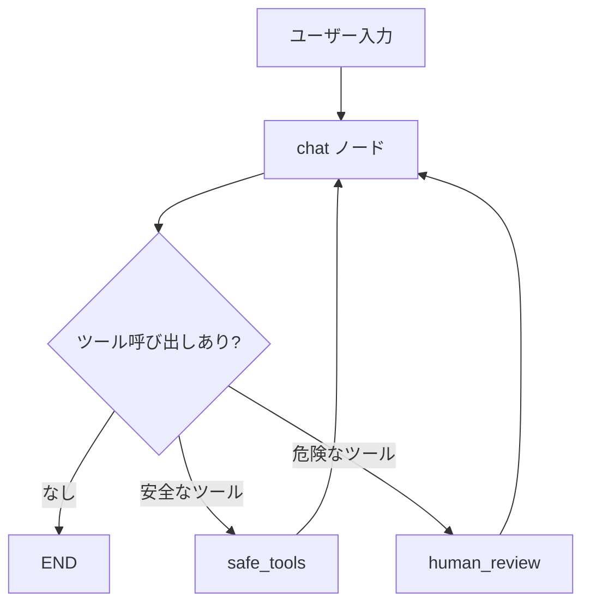

# Exercise 03: ツール呼び出し + human-in-the-loop

## 目標

- LangGraphでツール（Web検索、ファイル操作）を定義する
- LLMがツールを選択・呼び出す仕組みを理解する
- human-in-the-loop: 危険な操作の前にユーザー確認を入れる

## Exercise 02 との違い

02 ではLLMが応答するだけでしたが、ここでは **ツールを使って外部と連携** します。
グラフに条件分岐を追加し、ツール呼び出しの有無でフローが変わります。

## グラフの流れ



## 実行

```bash
make run-03
# または: uv run python exercises/03_tools/tool_chat.py
```

## ポイント

- `@tool` デコレータでツール関数を定義
- `llm.bind_tools()` でLLMにツールを認識させる
- 自前の `should_continue()` でツール呼び出し有無の分岐を実現
- ファイル書き込みなど副作用のある操作は `input()` で一時停止して確認
- ユーザーが承認した場合のみ実行される

## やってみよう

1. 「大阪の天気を教えて」と聞いてDuckDuckGo検索が動くことを確認
2. 「デスクトップにメモを書いて」でファイル書き込み提案 → 承認フローを体験
3. 新しいツールを追加してみる（例：計算ツール、時刻取得など）
