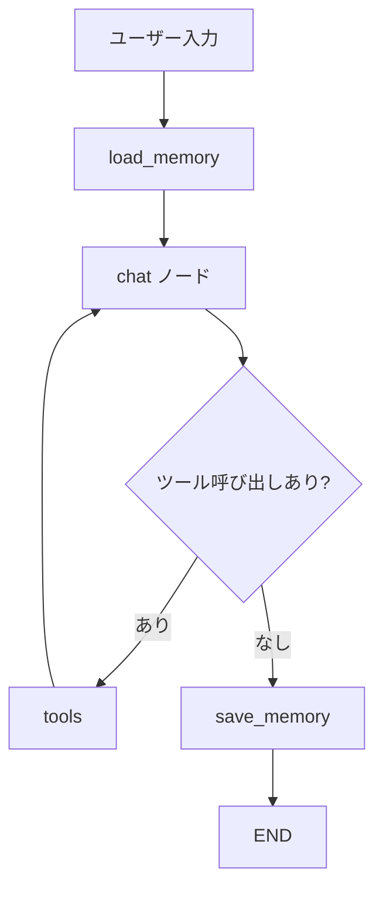

# Exercise 04: 要約メモリ + 構造化メモ

## 目標

- 会話の要点を要約して保存し、再起動後も参照できるようにする
- ユーザーの好みや進行中タスクを構造化メモとして保存する
- 長い会話でもコンテキスト長を超えないよう要約する仕組みを作る

## Exercise 03 との違い

03 まではセッション内の会話履歴のみでしたが、
ここでは **会話サマリと構造化メモをファイル保存する長期記憶** を追加します。

## グラフの流れ



## 実行

```bash
make run-04
# または: uv run python exercises/04_memory/memory_chat.py
```

## ポイント

- 文字数を計測し、一定量を超えたら要約を生成
- 会話サマリを `summary_memory.json` に保存する
- ユーザー情報を構造化メモとして保存する
- 次の質問では保存済みメモを system prompt に注入する

## 注意

意味検索は使いません。
その代わり、「今後の対話に必要な情報をどう整理して残すか」に集中します。

## やってみよう

1. 「私の好きな言語はPythonです」など、覚えてほしいことを話す
2. `memory_store/summary_memory.json` が保存されることを確認
3. 再起動後に「好きな言語は何だっけ？」と聞いて参照できることを確認
