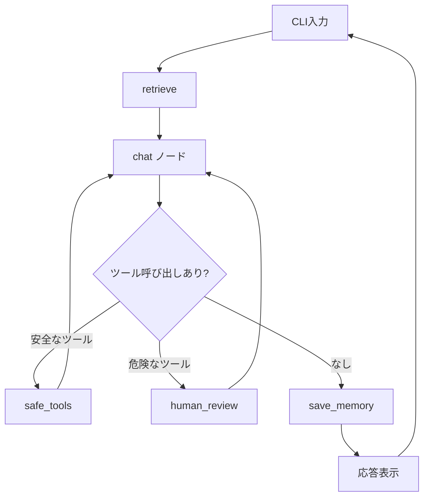

# Exercise 05: 常駐ループ完成版

## 目標

- asyncio を使った常駐型エージェントを完成させる
- 全機能（チャット、ツール、human-in-the-loop、要約メモリ）を統合する
- バックグラウンドで待機し、ユーザー入力に応答する

## Exercise 04 との違い

04 までの機能を全て統合し、asyncio で **常駐ループ** にします。
これが「自分専用常駐AIエージェント」の完成形です。

## グラフの流れ



## 実行

```bash
uv run python exercises/05_resident/tiny_claw.py
```

## ポイント

- `asyncio` で LangGraph 呼び出しと通常の入力待ちを扱う
- `ainvoke` でLangGraphを非同期呼び出し
- 保存済みの会話サマリとユーザー情報を起動時から参照する
- Ctrl+C でグレースフルにシャットダウン
- 全 Exercise の機能が統合されている

## 注意

危険ツールの承認確認は同期 `input()` を使っています。
そのため、承認待ちの間は処理が止まります。

## やってみよう

1. 起動して色々な質問やタスクを試す
2. 再起動後も、以前に保存したユーザー情報を参照できることを確認
3. 発展: 定期的なタスク実行（例: 毎時ニュースチェック）を追加してみる
