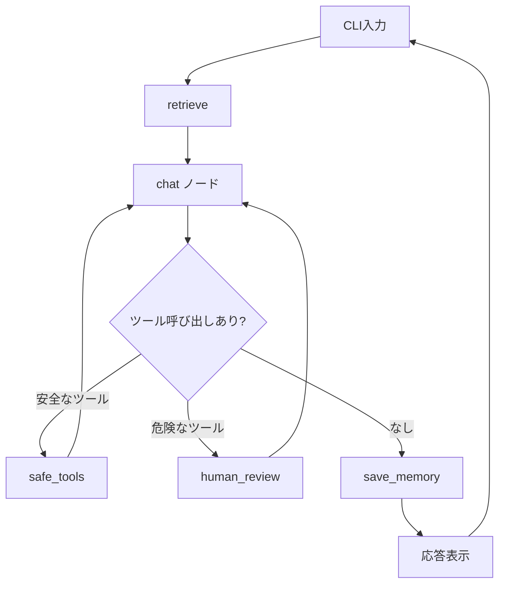

# Exercise 05: 常駐ループ完成版

## 目標

- asyncio を使った常駐型エージェントを完成させる
- 全機能（チャット、ツール、human-in-the-loop、要約メモリ）を統合する
- バックグラウンドで待機し、ユーザー入力に応答する

## Exercise 04 との違い

04 までの機能を全て統合し、asyncio で **常駐ループ** にします。
これが「自分専用常駐AIエージェント」の完成形です。

## グラフの流れ



## 実行

```bash
uv run python exercises/05_resident/tiny_claw.py
```

## ポイント

- `asyncio` で LangGraph 呼び出しと通常の入力待ちを扱う
- `ainvoke` でLangGraphを非同期呼び出し
- 保存済みの会話サマリとユーザー情報を起動時から参照する
- Ctrl+C でグレースフルにシャットダウン
- 全 Exercise の機能が統合されている

## 注意

危険ツールの承認確認は同期 `input()` を使っています。
そのため、承認待ちの間は処理が止まります。

## やってみよう

1. 起動して色々な質問やタスクを試す
2. 再起動後も、以前に保存したユーザー情報を参照できることを確認
3. 発展: 定期的なタスク実行（例: 毎時ニュースチェック）を追加してみる

## 考察: 5つの責務で振り返る

この完成版を、私が最近提案している[検索・計画・型・ツール・検証という5つの責務](https://x.com/24motz/articles)で見ると、次のように整理できます。

- 検索:
  保存済みメモを毎ターン読み込み、応答に使っているため、内部検索の責務を持っています。
- 計画:
  どの情報を使うか、ツールを使うかどうかの判断は LLM に任せていますが、明示的なタスク分解や実行計画は持っていません。
- 型:
  `AgentState`、ツールの入出力、保存メモの構造があるため、この教材では比較的しっかり扱えています。
- ツール:
  `web_search`、ファイル読み取り、ファイル書き込み、承認フローまで含めて実装できています。
- 検証:
  危険なツール実行前に承認を取る点は検証の入口ですが、結果の妥当性確認や再試行はまだ弱いです。

## 今後の課題

- 検索:
  保存メモをそのまま全部読むだけでなく、必要な情報だけを選んで参照できるようにする
- 計画:
  実行前に短いプランを出す、複数ステップの依頼を分解する
- 型:
  構造化出力の schema を厳密にし、保存メモの更新ルールを明確にする
- ツール:
  Web検索の改善、権限管理の強化、カレンダーやメールなど別のツール追加を行う
- 検証:
  ツール実行結果をチェックし、失敗時に修正や再試行を行う
